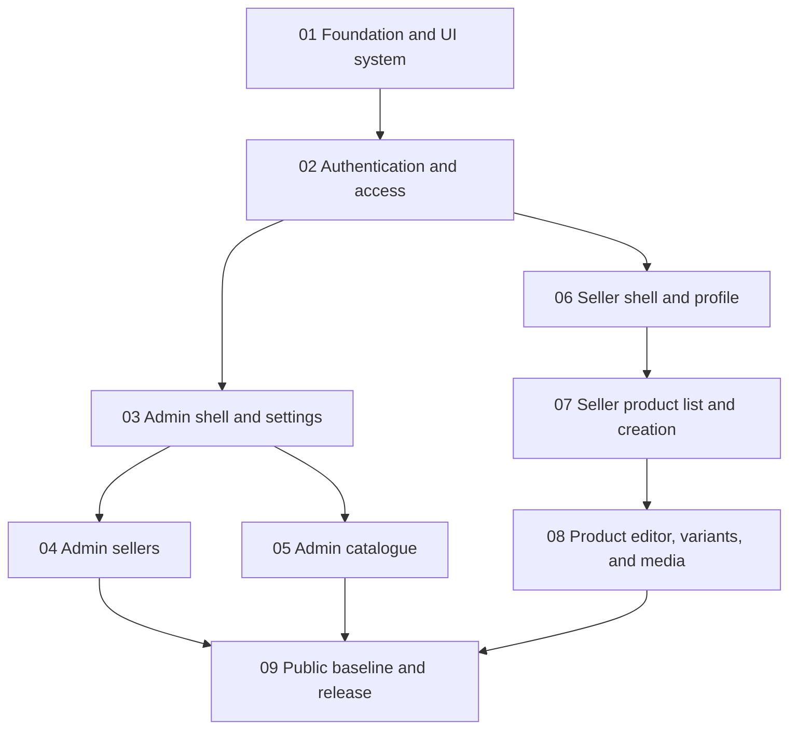

# Frontend step 1: admin and seller portals

## Plan identity

| Field | Value |
| --- | --- |
| Proposed branch | `frontend/step-1-admin-seller-portals` |
| Branch from | `windows/fixes` at `8f71022` or its reviewed successor |
| Delivery shape | One branch and one pull request, implemented as nine ordered subtasks |
| Overall status | `in_progress` |
| Implemented | No |
| Last reviewed | 9 October 2026 |

## Decision

Use one branch for this delivery.
The backend branches are stacked by coherent capability, and this frontend step is the first coherent user-facing capability built on backend steps 2 through 6.
The implementation is large, so it is divided into independently reviewable subtasks and commits within the branch.
If review size becomes a problem, the task boundaries below are valid split points, but the initial target remains one branch.

Do not branch from `main`.
At the time this plan was written, `main` stops before the backend work, while `windows/fixes` contains backend step 6 and the verified Windows setup fixes.

## Outcome

Deliver a responsive frontend that lets:

- any visitor sign in with an email code;
- an administrator manage platform settings, sellers, categories, and brands;
- a seller manage their profile, draft listings, variants, stock, and photos;
- any visitor see a polished public shell with the active category and brand data currently available;
- each signed-in role land in the correct area and be refused from areas it cannot use.

The result must use the existing APIs and business services.
It must not add SQL to pages, duplicate backend validation, or claim unsupported storefront features exist.

## Source of truth

Read these before implementation and revisit the relevant section for each task:

- `AGENTS.md` for repository rules and commands;
- `apps/web/AGENTS.md` and the relevant Next.js 16 guides in `apps/web/node_modules/next/dist/docs/`;
- `docs/system-design.md` sections 1, 4, 6.1, and 6.2;
- `docs/backend-spec.md` steps 2 through 6 and their API tables;
- `packages/core/src/modules/catalogue/types.ts` for category, brand, product, variant, and image contracts;
- `packages/core/src/modules/sellers/types.ts` for seller contracts;
- `packages/core/src/modules/settings/definitions.ts` and `service.ts` for setting shapes;
- the existing route handlers in `apps/web/src/app/api/` for response envelopes and status codes.

When a plan statement differs from code or the system design, the system design and current API contract win.
Update this plan in the same change when implementation discovers a mismatch.

## Confirmed backend boundary

Available now:

- Better Auth email OTP and sessions under `/api/auth/*`;
- `GET /api/me` with account identity, role, and seller id;
- admin settings read and update;
- admin seller creation, listing, detail, edit, approval, suspension, and reinstatement;
- seller profile read and contact update;
- public and admin category trees;
- public and admin brand lists;
- seller product creation, listing, detail, edit, and deletion;
- seller variant creation, edit, stock update, activation, and deletion;
- direct-to-storage image upload, registration, polling, ordering, metadata update, and deletion.

Unavailable and outside this branch:

- listing submission and admin review from backend step 7;
- imports from backend step 8;
- storefront products and search from backend step 9;
- cart, checkout, payments, orders, dispatch, returns, invoices, and seller earnings;
- production email or SMS provider configuration;
- e2e infrastructure that does not yet exist in the repository.

Do not render dead navigation for unavailable features.
A small labelled placeholder is acceptable only on the public home page where it honestly describes future availability.

## Route map

| Route | Access | Purpose |
| --- | --- | --- |
| `/` | Public | Brand introduction plus active category and brand discovery without fake products |
| `/sign-in` | Public | Two-stage email and OTP sign-in flow |
| `/admin` | Admin | Role landing page and links to available admin tools |
| `/admin/settings` | Admin | View and edit all platform settings |
| `/admin/sellers` | Admin | Filtered, paginated seller list |
| `/admin/sellers/new` | Admin | Create a seller and owner account |
| `/admin/sellers/[id]` | Admin | Seller detail, edit, approve, suspend, and reinstate |
| `/admin/categories` | Admin | Manage the full three-level category tree |
| `/admin/brands` | Admin | Search, paginate, create, edit, activate, and delete brands |
| `/seller` | Seller | Seller landing page with profile and catalogue summaries |
| `/seller/profile` | Seller | View business details and edit allowed contact fields |
| `/seller/products` | Seller | Filtered, paginated own-product list |
| `/seller/products/new` | Seller | Create a draft and initial variants |
| `/seller/products/[id]` | Seller | Edit listing details, variants, stock, and photos |

## Application structure

The implementation should converge on this shape without forcing empty abstraction layers:

```text
apps/web/src/
  app/
    (storefront)/
      layout.tsx
      page.tsx
      sign-in/page.tsx
    admin/
      layout.tsx
      page.tsx
      settings/page.tsx
      sellers/page.tsx
      sellers/new/page.tsx
      sellers/[id]/page.tsx
      categories/page.tsx
      brands/page.tsx
    seller/
      layout.tsx
      page.tsx
      profile/page.tsx
      products/page.tsx
      products/new/page.tsx
      products/[id]/page.tsx
    loading.tsx and error boundaries where they improve recovery
  components/
    ui/                  small shared primitives
    auth/                sign-in and account controls
    admin/               admin-specific interactive forms
    seller/              seller-specific interactive forms
  lib/
    auth-client.ts       Better Auth browser client
    page-auth.ts         server-side role checks and redirects
    api-client.ts        typed JSON/error handling for client mutations
    format.ts            money, dates, percentages, and labels
```

Prefer Server Components for initial data and page composition.
Use Client Components only for stateful forms, dialogs, uploads, polling, and controls that need browser APIs.
Server Components may call `@ecokart/core` services directly when that keeps data access simple.
Client Components must use the existing `/api` routes.

## Shared behavior contract

- Treat `{ error, issues? }` as the common error response.
- Show `issues` next to the affected form when possible and show `error` as the form summary.
- Handle 401 by offering sign-in and preserving a safe same-origin return path.
- Handle 403 with a clear role-specific access page or redirect.
- Handle 404 with the route-level not-found state.
- Handle 409 as a recoverable conflict and refresh stale data after the message is shown.
- Handle 503 as configuration unavailable and explain that an administrator must complete setup.
- Disable a mutation control while its request is pending.
- Require explicit confirmation for delete, suspension, deactivation, and slug changes.
- Keep cursor values opaque and return them unchanged as `?cursor=`.
- Format paise through `Intl.NumberFormat('en-IN', { style: 'currency', currency: 'INR' })` after dividing by 100.
- Format basis points as a percentage after dividing by 100.
- Render dates in `Asia/Kolkata` with an unambiguous day, month, year, and time where time matters.
- Preserve backend plain-English validation messages instead of translating them into generic failures.

## Visual and accessibility baseline

Use the existing EcoKart green as the primary colour and extend it into a small token set for surfaces, borders, focus, success, warning, and danger.
Use Tailwind CSS already installed in the app and avoid a component framework in this branch.
Build reusable controls for buttons, inputs, selects, text areas, field errors, status badges, cards, tables, empty states, pagination, dialogs, notices, and skeletons.

Every interactive control must have an accessible name, visible keyboard focus, and a usable disabled state.
Forms must use real labels and connect field errors with `aria-describedby`.
Dialogs must trap focus, close with Escape when safe, and restore focus to their trigger.
Tables must remain usable on a phone through stacked rows or deliberate horizontal scrolling.
Do not depend on colour alone for status.
Respect reduced motion.

Target widths:

- phone: 360 to 430 pixels;
- tablet: 768 pixels;
- desktop: 1280 pixels and wider.

## Task graph



## Tracking table

| ID | Task | Depends on | Implemented | File |
| --- | --- | --- | --- | --- |
| T01 | Foundation and UI system | None | Yes | [01-foundation.md](01-foundation.md) |
| T02 | Authentication and role access | T01 | Yes | [02-authentication.md](02-authentication.md) |
| T03 | Admin shell and platform settings | T01, T02 | No - browser check pending | [03-admin-settings.md](03-admin-settings.md) |
| T04 | Admin seller management | T03 | No - final browser pass pending | [04-admin-sellers.md](04-admin-sellers.md) |
| T05 | Admin category and brand management | T03 | No - final browser pass pending | [05-admin-catalogue.md](05-admin-catalogue.md) |
| T06 | Seller shell and profile | T01, T02 | No - final browser pass pending | [06-seller-profile.md](06-seller-profile.md) |
| T07 | Seller product list and draft creation | T05, T06 | No | [07-seller-products.md](07-seller-products.md) |
| T08 | Product editor, variants, and photos | T07 | No | [08-product-editor.md](08-product-editor.md) |
| T09 | Public baseline, hardening, and release evidence | T04, T05, T08 | No | [09-release.md](09-release.md) |

## Working method

1. Create `frontend/step-1-admin-seller-portals` from the reviewed `windows/fixes` head.
2. Implement tasks in dependency order.
3. Keep each task in a focused commit when practical.
4. Update its `Implemented` field only after every acceptance criterion passes.
5. Record implementation evidence as commit hash plus important file paths.
6. Record test evidence as the exact command, result, and date whenever testing is performed.
7. Record manual evidence with route, role, viewport, browser, and observed result.
8. Keep `pnpm typecheck`, `pnpm lint`, and relevant tests green after every task.
9. Run the full release matrix in T09 before opening the pull request.

## Evidence rules

`Implemented: Yes` is valid only when the task's acceptance criteria are complete.
Every implemented task must list changed files or a commit hash under implementation evidence.
If any automated or manual test was run, its evidence is mandatory and must include the command or reproduction and its observed result.
Do not write `works`, `tested`, or `done` without reproducible details.
Use screenshots only as supporting evidence because they do not prove permissions, data changes, or error handling.

## Pull request completion gate

- All nine task files say `Implemented: Yes`.
- No UI points to an API that does not exist on the branch.
- Admin and seller role checks run on the server before protected page content is rendered.
- The primary workflows work through the real API and local services.
- Empty, loading, success, validation, conflict, forbidden, and unexpected-error states are covered.
- Phone and desktop layouts have been checked in Chrome and Safari.
- `pnpm check` passes.
- The PR description identifies the base branch, routes delivered, explicit non-goals, and verification evidence.
